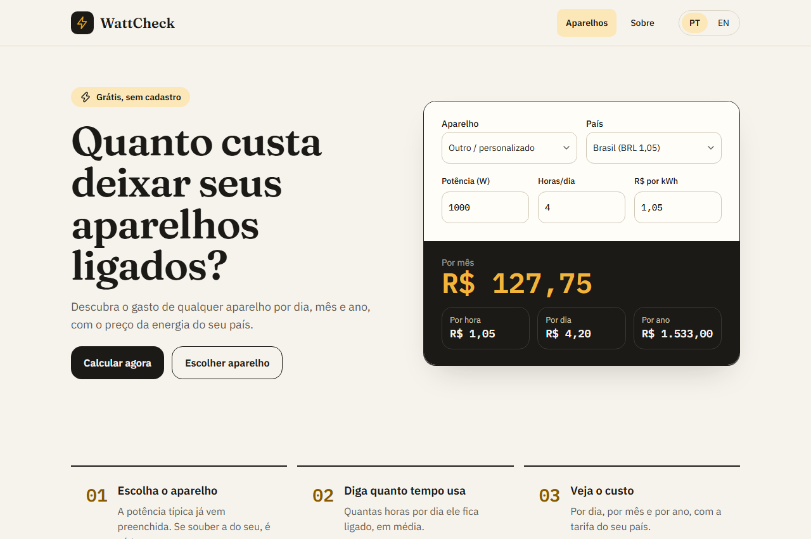

# WattCheck

Calculadora de custo de energia por aparelho — **"quanto custa deixar isso ligado?"**. Informa potência, tempo de uso e a tarifa, e o resultado (por hora, dia, mês e ano) atualiza em tempo real, sem botão de "calcular".

**🔗 No ar:** [wattcheck.santux.com.br](https://wattcheck.santux.com.br) &nbsp;·&nbsp; 🇧🇷 [/pt](https://wattcheck.santux.com.br/pt) &nbsp;·&nbsp; 🇺🇸 [/en](https://wattcheck.santux.com.br/en)

[](https://github.com/Fabricio-santuchi/calculadora-energia/actions/workflows/ci.yml)




## O projeto

Site 100% estático (sem backend, sem banco de dados), em português e inglês, com uma página por aparelho (PC gamer, geladeira, ar-condicionado, chuveiro elétrico, entre outros), cada uma com texto de apoio e FAQ próprios para SEO. Construído do zero como projeto de aprendizado — a lista completa de decisões e tarefas está em [`CLAUDE.md`](./CLAUDE.md).

Desenvolvido com auxílio de IA (Claude Code) como assistente de programação — arquitetura, decisões técnicas, design das telas e revisão do código são minhas.

## Decisões técnicas

- **Export estático (`output: 'export'`)** — sem servidor, hospedado de graça na Cloudflare. Isso descarta `middleware`, `redirects`/`rewrites` do Next e qualquer lógica que dependa de servidor: internacionalização, por exemplo, não usa o `i18n` do Next (não funciona em export estático) e sim uma pasta de rota própria (`app/[lang]/`).
- **Cálculo ao vivo** — o resultado atualiza a cada tecla digitada, sem `onSubmit`. A validação (Zod) só mostra erro depois que o campo perde o foco, pra não interromper quem ainda está digitando.
- **Rota dinâmica por aparelho** — uma página (`app/[lang]/[aparelho]/page.tsx`) atende todos os aparelhos, buscando dados e texto por slug. Aparelhos exclusivos de um idioma (o chuveiro elétrico só existe em português, pouca busca em inglês) simplesmente não entram no `generateStaticParams` daquele idioma — a rota nem chega a existir, sem precisar de lógica condicional de 404.
- **Função de cálculo sem opinião de moeda** — `lib/calculo.ts` só recebe e devolve números; quem formata com símbolo de moeda (R$, $, £) é a interface, via `Intl.NumberFormat`. Mantém a lógica de negócio testável sem depender de locale.
- **Parsing de número tolerante a vírgula** — em português o campo aceita `"0,75"` tanto quanto `"0.75"`; a conversão é uma função própria e testada antes de chegar no schema do Zod.

## Stack

Next.js (App Router) · TypeScript (`strict`) · Tailwind CSS + shadcn/ui · Zod · Jest + React Testing Library · Playwright · GitHub Actions · Cloudflare (Workers + Email Routing, sem cookies no Analytics)

## Qualidade

| | |
|---|---|
| Testes unitários/componente (Jest) | 151 |
| Testes ponta a ponta (Playwright) | 66 |
| Lighthouse (Performance / SEO) | 100 / 100 |
| Lighthouse (Acessibilidade / Boas Práticas) | 98-100 / 96 |
| CI | lint + `tsc --noEmit` + Jest + build a cada push |

## Rodando localmente

```bash
npm install
npm run dev       # http://localhost:3000
npm test          # testes unitários/componente
npm run build     # gera a pasta out/ (export estático)
npm run test:e2e  # testes ponta a ponta (precisa do build)
```
